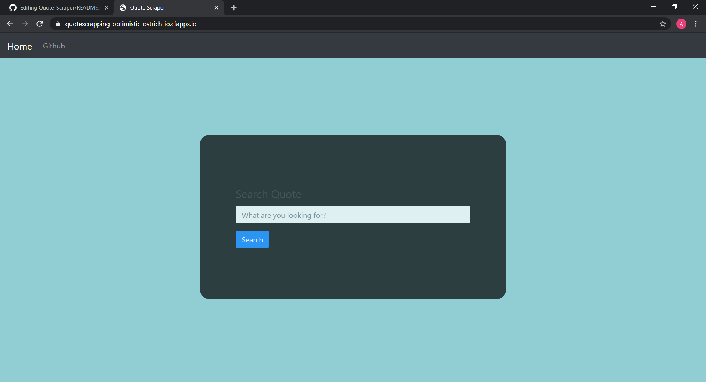
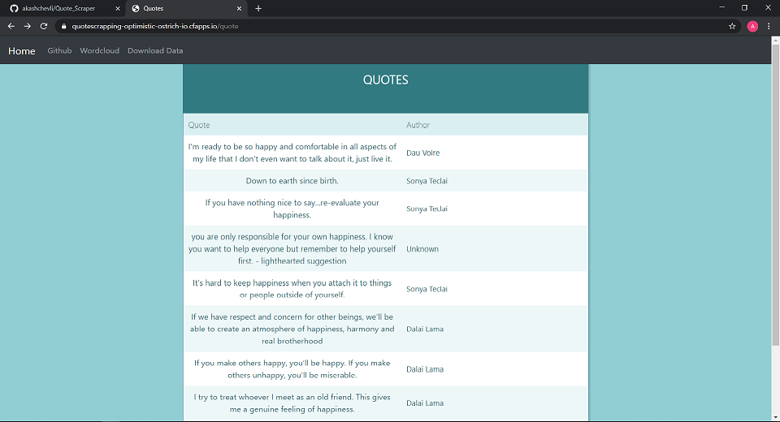
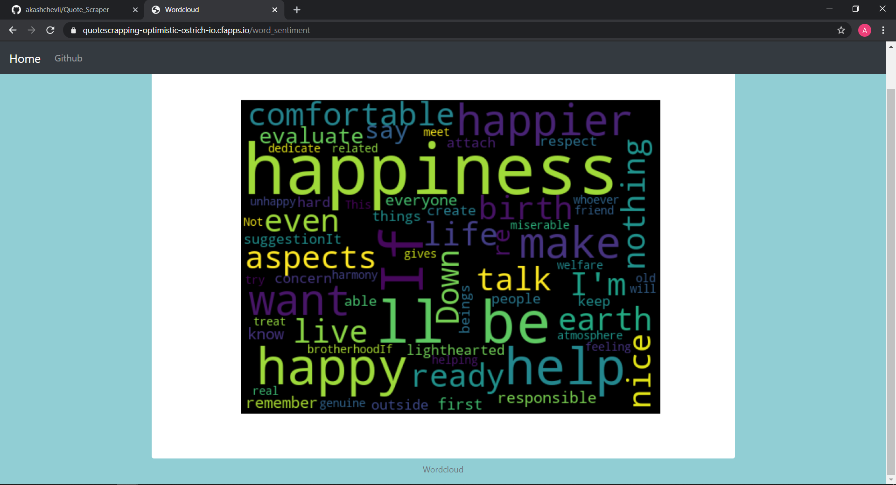

# Quote_Scraper

This is the flask base application to scrap the quotes from the website. Website is https://www.thegood.co. 

### For live demo you can check here:- https://quotescrapping-optimistic-ostrich-io.cfapps.io/

### Below is the screenshot of the website.

### 1. Home page with search option.

### 2. Below page display all quotes base on category search by user. You can also download data.

### 3. Worldcloud is text sentiment of the data. You can click onto the wordcloud tab to see the wordcloud.

This is the flow of the website.

